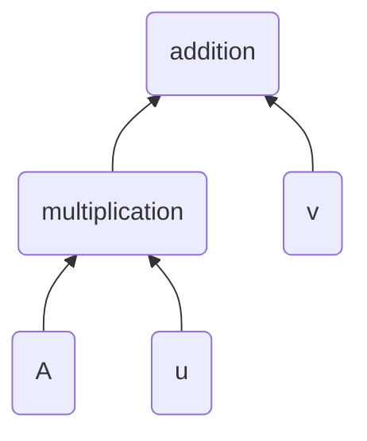
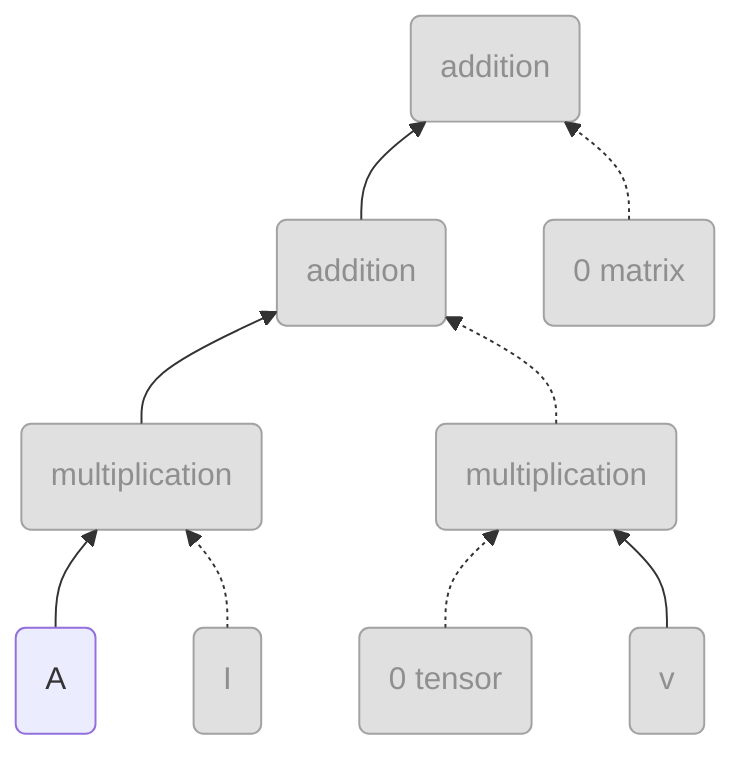

<div align="center">

</div>

A light-weight header-only C++ library for linear algebra with automatic differentiation, focusing on natural mathematical syntax and ease of use.

## Design Philosophy

- TinyLA follows the idea that well-formed mathematical expressions should map directly to well-formed code. Code representing ill-formed expressions should fail to compile, with strict enforcement of dimensional consistency.

- All expressions are matrices: column vectors are single-column matrices, and scalars are 1x1 matrices. Practical aliases help avoid verbosity when declaring variables.

- The derivative of any expression with respect to any variable is another valid expression, even if the original expression does not depend on that variable (yielding zero).

- Expressions remain unevaluated until a numeric result is explicitly required. Keeping analytical forms enables transformations such as differentiation and simplification while maintaining dependence on original variables.

- Algebraic expressions are immutable: operations create new expressions. Variables can change value, allowing expressions to act as functions.


## Installation
Using CMake, you can fetch the content of this repository using FetchContent as follows
```cmake
include(FetchContent)
FetchContent_Declare(TinyLA_content
    GIT_REPOSITORY https://github.com/TheFlyingPiano99/TinyLA.git
    GIT_TAG main
    GIT_SHALLOW TRUE)
FetchContent_MakeAvailable(TinyLA_content)

target_link_libraries(${YOUR_TARGET} PRIVATE TinyLA::TinyLA)
```
Alternatively, you can copy the `TinyLA.h` file into your project's own include folder. In this case make sure to define the `ENABLE_CUDA_SUPPORT` flag in your source code if you want to use the library with CUDA!

## Examples

### Basic Scalar Operations

```cpp
    #include "TinyLA.h"
    #include <iostream>

    // Scalar variables
    auto x = tinyla::dscal_var<'x'>{5.0};   // Variable with ID 'x'
    auto y = tinyla::dscal_var<'y'>{3.0};   // Variable with ID 'y'
    const auto constant = tinyla::dscal{2.0}; // Constant (no variable ID)

    // Define an expression
    auto expr = (x + y) * constant - x / y;

    // Print the symbolic expression and the value
    std::cout << "Expression: " << expr.to_string() << std::endl;
    std::cout << "Value: " << expr.eval() << std::endl;
```

### Vector Operations

```cpp
    // Create 3D vectors
    auto v1 = tinyla::dvec3_var<'u'>{1.0, 2.0, 3.0};  // Variable vector with ID 'u'
    auto v2 = tinyla::dvec3{4.0, 5.0, 6.0};       // Constant vector

    // Vector arithmetic
    auto sum = v1 + v2;
    auto scaled = v1 * 2.0;
    auto dot_prod = dot(transpose(v1), v2);

    print_expr(dot_prod);
```

### Matrix Operations

```cpp
    // Create matrices
    auto matA = tinyla::dmat2{{1.0, 2.0}, {3.0, 4.0}};
    auto matB = tinyla::dmat2{{5.0, 6.0}, {7.0, 8.0}};
    auto matC = tinyla::dmat2{{9.0, 10.0}, {11.0, 12.0}};
    auto vec = tinyla::dvec2{1.0, 2.0};

    // Matrix operations
    auto matSum = matA + matB;
    auto matProd = matA * matB;
    auto elemProd = elementwiseProduct(matA, matB);
    auto transposed = transpose(matA);
    auto matVecProd = matA * vec;
```

### Automatic Differentiation

```cpp
    // Create variables
    auto A = tinyla::dmat2_var<'A'>{{2.0, 1.0}, {1.0, 3.0}};
    auto x2 = tinyla::dvec2_var<'x'>{5.0, 2.0};

    // Write an expression
    auto expr2 = transpose(A) * A * x2 + x2 + 5;

    // Derivate
    auto dx = expr2.derivate<'x'>();  // Derivative with respect to vector x
    auto dA = expr2.derivate<'A'>();  // Derivative with respect to matrix A

    std::cout << "d expr/dx = " << dx.to_string() << std::endl;
    std::cout << "d expr/dx at (0,0): " << dx.eval(0, 0) << std::endl;
    std::cout << "d expr/dA = " << dA.to_string() << std::endl;
    std::cout << "d expr/dA at (0,0): " << dA.eval(0, 0) << std::endl;
```

### Complex Numbers

```cpp
    // Complex-valued matrix
    auto cmat = tinyla::cmat2_var<'M'>{{std::complex<double>(1.0, 0.5), std::complex<double>(2.0, -1.0)},
                                {std::complex<double>(0.0, 1.0), std::complex<double>(3.0, 0.0)}};

    auto cmat2 = tinyla::cmat2_var<'A'>{{std::complex<double>(1.0, 0.5), std::complex<double>(2.0, -1.0)},
                                {std::complex<double>(0.0, 1.0), std::complex<double>(3.0, 0.0)}};
    // Complex operations
    auto conjugated = conj(cmat);
    auto adjoint_matrix = adjoint(cmat);  // Conjugate transpose

    auto cdiff = (cmat * cmat2).derivate<'M'>();  // Derivative with respect to matrix M
    std::cout << "d cmat/dM = " << cdiff.to_string() << std::endl;
    std::cout << "d cmat/dM at (0,0): " << cdiff.eval(0, 0, 0, 0) << std::endl;
```

### Type Aliases and mixed-type expressions

```cpp
    auto float_matrix = tinyla::fmat2{{1.0f, 2.0f}, {3.0f, 4.0f}};
    auto double_vector = tinyla::dvec2{1.0, 2.0};
    auto complex_scalar = tinyla::cscal{std::complex<double>(1.0, 0.5)};

    // Different data types with character-based variable IDs
    auto float_matrix_variable = tinyla::fmat2_var<'M'>{{1.0f, 2.0f}, {3.0f, 4.0f}};
    auto double_vector_variable = tinyla::dvec2_var<'v'>{1.0, 2.0};

    // All work together in expressions
    auto mixed_expr = complex_scalar * float_matrix * double_vector;
```

### Mathematical Constants and Special Matrices

```cpp
    // Mathematical constants
    auto pi = tinyla::pi<double>;     // π constant
    auto e = tinyla::euler<double>;   // Euler's number

    
    // Special matrices
    auto identity3 = tinyla::identity<double, 3>{};
    auto zero = tinyla::zero<double>{}; // A matrix filled with 0
    auto ones23 = tinyla::ones<double, 2, 3>{}; // A matrix filled with 1
```

## How it works

TinyLA uses C++ expression templates to represent computation tree through template metaprogramming.
This enables lazy evaluation of complex algebraic expressions.
The computation tree is constructed at compile time, allowing expression simplification and analytic differentiation with no additional runtime cost.

### Calculation tree manipulation

Consider the expression
$f(u, v, A) = Au + v \text{, where  } u,v \in \mathbb{R}^n, A \in \mathbb{R}^{n\times n}, n = 2, 3, \dots$
The computation tree of this expression is

The derivative of function $f$ with respect to vector $u$ is
$\delta f(u, v, A) / \delta v = (A\frac{\delta u}{\delta u} + \frac{\delta A}{\delta u}u) + \frac{\delta v}{\delta u} = (AI_{n \times n} + 0_{n\times n \times n}u) + 0_{n \times n} = A$, where $I_{n\times n}$ is the $n\times n$ indentity matrix which is in this case the Jacobian matrix of $u$, $0_{n \times n \times n}$ is the $n \times n \times n$ shaped 3D full-zero tensor and $0_{n \times n}$ is the Jacobian of $v$.
The computation tree of the derivative is

This expression is simplified by removing the branches yielding zero and multiplications by the identity matrix.


## License

This project is licensed under the MIT License - see the [LICENSE](LICENSE) file for details.

Copyright (c) 2025 Zoltán Simon

The MIT License is a permissive license that allows you to use, modify, and distribute this software freely, including for commercial purposes, as long as you include the original copyright notice and license text.

